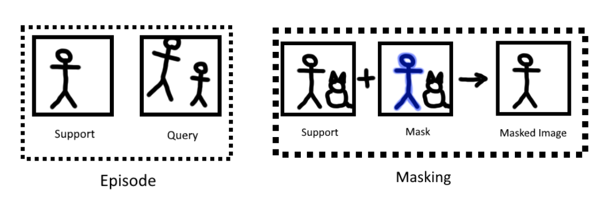

# Few Shot Learning
**Achieving accurate object recognition with minimal data**

Humans possess an innate ability to quickly learn and recognize new objects with just a few examples. We can take one glance at a new object and immediately segment it out from its surroundings. However, for machines the process is not so simple.

Traditionally, computer vision networks require hundreds of iterations over thousands of images to achieve human-like performance in image segmentation tasks. But what if we could close the gap between human and machine, by creating networks that need very few training images (20 compared to 200,000) to segment an object it has never seen before (novel class) in an image? This is where the field of "few-shot semantic segmentation" (FSS) comes in.

In this blog post, I will take a closer look at some of the current state-of-the-art FSS networks, and explore how they work, how they are trained, and how they can be applied in new situations. To see how they match up to approaches using many images, I will also compare each of these networks to an existing convolutional neural network (CNN) and evaluate their performances.

As I delve deeper into the world of FSS, one question remains at the forefront of my mind: Will FSS networks give the same performance as CNNs, with fewer images? This would reduce the need for collecting and labelling more images, often a tedious and costly task. Join me as I explore this exciting field and find out.

## Few Shot Segmentation
**FSS networks are not learning classes, but learning where images look similar to class instances**

FSS is a technique in computer vision that allows a model to learn to identify novel classes in an image using only a small number of examples for each class. This is achieved by using a pre-trained model and fine-tuning it on new data.

FSS networks typically work using a technique called "episodes" of support and query images. The network is provided with a support image that contains an instance of the new class, demarcated by a filter (or mask), and a query image that it needs to segment the new class out of. Both images are then passed through a "backbone" network, which is a pre-trained convolutional neural network (CNN) with the classification layers removed.

The backbone network extracts features from different layers, ranging from simple shapes such as circles and lines to more complex textures. The features extracted from the support image are then compared to the features extracted from the query image. The network identifies the areas in the query image that look similar to the new class features, and uses this information to segment the new class out of the query image.

(feature map explanation picture)

One key feature of FSS is its ability to generalize what the network has learned to new images. This is achieved by training the network on a large number of episodes, each containing a different pair of support and query images, to learn the features and patterns of the new class. The network is then able to recognize similar features in the query image and segment out the new class.

FSS networks are not learning to recognize specific classes based on a large number of examples, but rather learning to identify patterns and features that are indicative of a certain class. They are able to do this by using a small number of examples, and then using this knowledge to segment new instances of that class in new images.

By using the episodes of support and query images the network is able to extract features and compare them, to identify the regions of the query image that look similar to the support image and then generalize this knowledge to new images and classes. Therefore, it can be said that FSS networks are not learning classes, but learning where query images look similar to support  class instances.

Additionally, FSS models also use various techniques like meta-learning, attention mechanisms, and memory networks to improve their ability to learn from a few examples and adapt to new classes.  Some of which will be discussed later.

In summary, and as shown in the diagram below, FSS networks use a pre-trained CNN to extract features from support and query images, compare the features, and segment new classes out of the query image by identifying similar patterns. They are able to learn from a small number of examples and generalize to new images and classes by training on a large number of episodes, and by incorporating various techniques to improve their performance. I will now explore a few FSS networks more in-depth: the Hyper Correlation Squeeze Network (HSNet), Multi-Similarity and Attention Guidance network (MSANet), test them on a dataset and compare the results to a state of the art segmentation model that was trained on a large number of images.

(fss explained)

# Hyper Correlation Squeeze Network
**HSNet uses a pixel-wise comparison between the support and query images to generate a precise mask of the novel class on the query image**

The "Hyper Correlation Squeeze Network" or "HSNet" was a state-of-the-art model for few-shot segmentation introduced in October 2021. It set new performance levels on several datasets in the field, due to its novel coarse-to-fine approach. 

The model works by comparing every pixel in the query image with every pixel in the support image, creating a four-dimensional tensor that stores the similarity between the pixels. This tensor is then gradually decoded into a mask, which segments the novel class out of the query image. In essence, HSNet uses a pixel-wise comparison between the support and query images to generate a precise mask of the novel class on the query image.

During the training process, episodes of images are fed through a backbone CNN, which produces pairs of feature maps (one map for the support image and one for the query image). A variety of networks can be chosen to produce the feature maps, however RESNET-101 achieved the best results. The feature maps from the support image are masked so that irrelevant activations are not used.

(HSNet decoder)

Next, the model analyses each feature map pair to create a 4D correlation tensor. This tensor measures the similarity between the support features and query features at a pixel wise level. This process is repeated for all feature map pairs, and all the 4D correlation tensors are combined into an overall encoded context. The resulting context contains how similar each pixel is from the support image to each pixel in the query image at every level in the backbone network.

Finally, the encoded context is decoded back to two dimensions using simple 2D convolutions and upsampling. This creates a probability map for each pixel of the query image, indicating the likelihood of it belonging to the novel class. When training the network, this pixel-level probability can be used to measure how correct the network is, and the error can be sent back through the network to improve its segmentation with future images. When testing, each pixel is assigned to its highest probability class, thereby creating a mask that locates the novel class on the query image.

# Multi-Similarity and Attention Guidance
**Uses an attention guidance module and a base learner**

The next network I looked at is the Multi-Similarity and Attention Guidance network (MSANet). When it was released in June 2022 it achieved SOTA in both the PASCA-5i and COCO-20i datasets (in both 1-shot and 5-shot). By combining aspects of many other different models MSANet was able to achieve a very high score across the board. However, recent developments using transformers have been able to edge in front of MSANet in every category except COCO-20i 1-shot.

MSANet works with a similar high-level strategy as HSNet. It breaks both images into the feature maps and then compares where those feature maps are similar. However, it extends on this by adding an attention guidance module that looks at the support images to try to guide the network into looking into areas of the query image that have a similar composition as the novel class. In addition, it uses a base learner that has been trained on over 1000 classes to get a rough segmentation in order to fine tune the boundaries of the predicted mask.

## Cosine Similarity
**Squeezing features for efficiency of image comparison**

The process begins by sending images through a Convolutional Neural Network (CNN) to extract feature map pairs. The feature maps of the support image, which serves as a reference, are then modified by removing any activations that do not correspond to the class of the image, and by squeezing the remaining pixels together by removing any pixels that are below the mean value for that feature map. On the other hand, the query images are not modified in this way as the network is looking for where the query images look most similar to the support images. To determine the similarity between the query and support images, the cosine similarity (CS) of each pixel in the query feature map is calculated with respect to all of the squeezed support feature maps, and an average is taken. This process is repeated for each of the extracted feature layers and the results are concatenated together. The final result is a multi-layered CS map that is passed through a 1x1 convolution to create a 2D map which shows where the query image is most similar to the masked support image.

(Squeezed features)

(cosine similarity)

## Attention Guidance
**Guiding the network to look in the right places for the novel class**

The attention guidance module uses lower level activation features of the masked support image. It concatenates the features together then passes them through a 1x1 convolution to create a flat 2D map of the features. Then it turns this 2D map into a vector that when passed over the query feature map creates a rough area where the two images have similar features.

(image of attention guidance)

## ASPP & Classification
Finally, the results of the CS map, the support and query features and the attention module are all combined together in an Atrous Spatial Pyramid Pooling (ASPP) module. Without going on a tangent, this module combines all the information given into it, enhancing certain features at different dilations of convolution. This creates a final tensor that is convolved into using a classifier into a final prediction mask.

## Base learner
In addition, MSANet makes use of a base learner which is trained on thousands of different classes. This will create a segmentation of the image according to what it knows already. Then this segmentation is removed from the final classification up until now, trimming down any false positives that go outside the boundary of the novel class.

(picture)

# Comparison to conventional networks
**Comparing FSS to CNN in the task of segmenting people**

With the networks introduced, it's time to test them against tools used in the industry. Given the diagrams up until now, it seemed fitting to use the detection of people as the comparison task. In addition, detecting people is something that networks have been trained to do for a while and there are very accurate networks for this task.

For my test set, I selected a subset of 256 images from the validation set of "Cityscapes2" to test my FSS networks against a network trained specifically to segment people from a different dataset. The conventional network I chose is “deeplabv3 resnet101”. This is a pretrained network on the Microsoft "Common Objects in Context" dataset achieving a mean intersection over union of 67.4% when segmenting this dataset. I chose this network because it is easy to import from torch vision and therefore would be an obvious choice to most people who need a quick solution. 

In order to gain an extensive insight into how well each network was performing I recorded a great deal of information about every inference that the networks made. For each predicted mask of a query image I record:
- Predicted mask size
- Actual mask size
- The intersection between the predicted and actual mask
- How many pixels incorrectly predicted
- The union of predicted and actual mask
- The intersection over union of the prediction and actual mask
- The percentage of the actual mask that was predicted

## Results – CNN

To set the baseline performance of the CNN I used, it achieved an average Intersection over Union (IOU) of 0.178. Though this score may seem low, it is important to note that it was heavily affected by instances where the CNN scored 0. This was due to a variety of factors such as small and distant individuals in the dataset, grainy images, and loss of information through image resizing. As shown in the following image, the network's performance also varied based on the size of the people in the image.        

(CNN IOU against class size)

The CNN's performance on larger individuals in the dataset, with an average IOU of 0.65 to 0.75, is consistent with its overall performance on the dataset it was trained on. Additionally, it is known that humans have difficulty seeing objects at a distance, hence CNN's ability to accurately segment distant individuals in images suggests that it performs to a similar level to people.

Furthermore, the network segmented individuals on bicycles, even though they were not considered as "pedestrians" in the dataset. To maintain accuracy and prevent penalising the network's performance, images containing individuals on bicycles were removed from further calculations.

Lastly, it was observed that the false positive rate of the CNN is influenced by the size of the person in the image. Larger individuals in the images resulted in a higher amount of false positive pixels being segmented, as seen in the accompanying graph.

(False positive against class size CNN)
  
## Results – HSNet

The HSNet model has a mean IOU score of 0.07, which is lower than every other network tested. This is due to its method of comparing every pixel to every other pixel, which is computationally expensive and less effective compared to more advanced methods.

During the experimentation with the network, I discovered that the choice of support images has a significant impact on its performance. By sampling the support images from the top 20 largest people, I was able to increase the mean IOU from 0.07 to 0.13, nearly doubling its performance. The accompanying graphs provide a more detailed representation of the results.

(Double graph of full support vs detailed support)
 
To better understand the relationship between the network's performance and the size of the person in the image, I plotted the IOU score on the y-axis and the size of the person on the x-axis. As shown in the first graph, the network's performance varied widely when it could sample support images from any image containing people. The vertical clusters of datapoints represent the same image evaluated using different support images.

In the second graph, I limited the support image selection to only the 20 largest instances of people. This resulted in more consistent and higher average performance, as the added detail from the larger and closer support images helped to improve the network's understanding of what a person looks like.

Despite the improved performance, HSNet still demonstrated a persistent issue with false positives across all support sets. The graph does not capture the extent of pixels incorrectly identified as people by the network. False positives can significantly impact the accuracy of the network and it is important to address this issue in future iterations of the model. Further investigation is needed to understand the root cause of the false positives and to find ways to reduce or eliminate them. Addressing this issue would likely lead to an even more reliable and accurate network, which would be of great value for a variety of computer vision applications. Below are some graphs that show the false positive rates for the two support sets.

(Double graph of false positives)

## Results - MSANet

MSANet also demonstrated improvement with the use of a more detailed support set, resulting in a mean IOU increase from 0.10 to 0.14. This improvement, although not a doubling, is still significant and brings the network's performance closer to the average IOU achieved by the CNN. The improved performance of MSANet highlights the importance of support set selection in FSS networks and the potential impact it can have on accuracy and reliability. The following graph has the results from the two support classes.

(double graph of full support vs detailed support)

The similarity between MSANet and the CNN extends beyond just the mean IOU score. The performance dynamics of the two networks also show similarities, particularly in how the network's performance increases with the size of the query image. As the size of the person in the query image increases, the performance of both MSANet and the CNN shows a logarithmic improvement. This logarithmic curve eventually flattens out after the query image size reaches around 0.5. These findings suggest that MSANet is a strong contender as an alternative to a CNN in scenarios where there may not be sufficient data available for training a more complex model. The logarithmic improvement with increasing query image size suggests that with bigger query images there are more features extracted from the novel class by the backbone and MSANet is more easily able to detect the class.

(CNN vs MSANet IOU against class size)

Despite the improved performance compared to HSNet, MSANet still falls behind the CNN in terms of false positive rate. Although the use of a detailed support set helped reduce the number of false positive pixels, the CNN still outperforms MSANet in this aspect with an average of only 2,000 false positive pixels per classification. This difference highlights the need for continual improvement and refinement in the design of these types of networks, especially in real-world applications where false positive detections can lead to serious consequences. Nonetheless, the improvement seen in MSANet demonstrates the potential for these networks to be used in a range of tasks, and with further advancements, they may one day rival or even surpass the performance of traditional CNNs.

## Results - Comparison Table

To directly compare all of the results from the different networks and their support sets, I have created the following table which shows that the CNN was able to perform the best out of all the networks I tested. MSANet performed better than HSNet when using the same support set, however HSNet using the detailed support set was able to do better than MSANet using the full support set. While the average IOU seems to be quite close, looking at the performance graphs above it is clear that MSANet is more consistently higher scoring, while HSNet appears to vary much more but giving it a similar average score.

|          **Network**          | **Average IOU** | **Comments** |
|:-----------------------------:|:---------------:|:------------:|
| CNN (DeeplabV3)               | 0.178           | Best Overall |
| HSNet (Full Support Set)      | 0.071           |              |
| HSNet (Detailed Support Set)  | 0.134           | Best HSNet   |
| MSANet (Full Support Set)     | 0.108           |              |
| MSANet (Detailed Support Set) | 0.140           | Best FSS     |

# Conclusions

Based on the results of this investigation, it can be concluded that FSS models are becoming, or have already become, viable alternatives to CNNs when there is limited data available. It is important to note that the FSS networks used in these experiments had no prior exposure to people and yet their performance was comparable to a CNN that was trained on over 200,000 instances of people. This highlights the potential of FSS models as a solution for scenarios where the amount of training data is limited. Furthermore, if this experiment was repeated using a different class that the CNN was not trained on, the CNN would achieve an IOU score of 0.

The findings of this investigation underscore the significance of the support set in determining the performance of FSS models. The choice of support set has a profound impact on the ability of the network to accurately segment the query image. The results suggest that larger support images, where more features are able to be extracted, lead to a more precise segmentation. Furthermore, the performance of the network was found to improve with increasing size of the instance of the class being sought, which is likely also due to the extraction of additional features. However, the inverse relationship between support image size and query image size was not observed, as smaller support images were not conducive towards better identifying smaller query images.

Finally, it was observed that both the FSS networks tested demonstrated high false positive rates. This, along with a less precise course and rough estimation of the class location within the image, appears to be the trade-off for relying on only five support images to identify the class. Although this may not seem like a significant issue, it can become problematic in contexts where precise location of the class is essential, such as in medical imaging for detecting tumours. The level of precision achieved by the networks tested in this investigation may not be sufficient for such applications.

In conclusion, the world of computer vision is rapidly advancing and FSS is becoming a contender to the traditional CNNs. In only the time it took to conduct this investigation, the rankings in this field shifted dramatically and MSANet's performance was no longer at the top. With this in mind, it's crucial to stay abreast of the latest developments in this thrilling field. You never know, the next time you're tasked with segmenting a new class, FSS might just be the go-to solution. Keep your eyes peeled and be ready for what the future holds!
